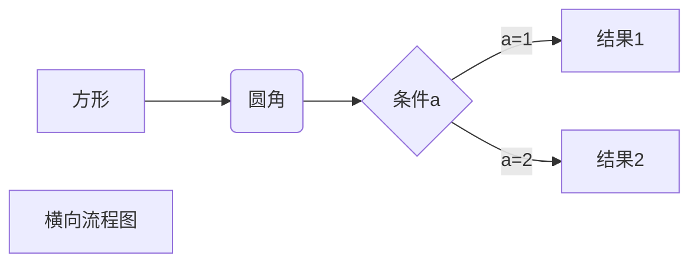
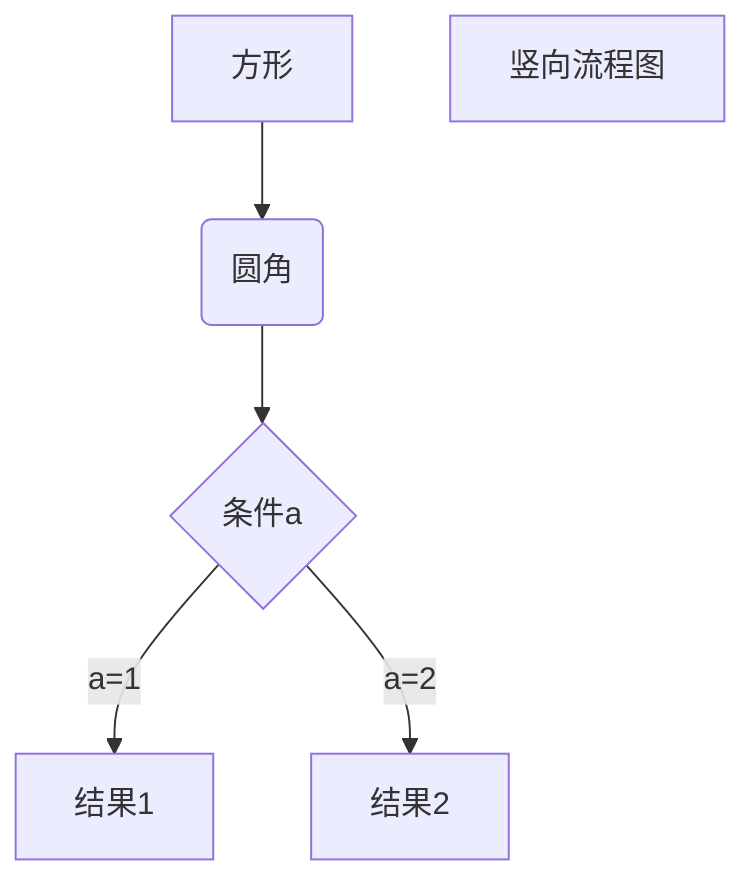
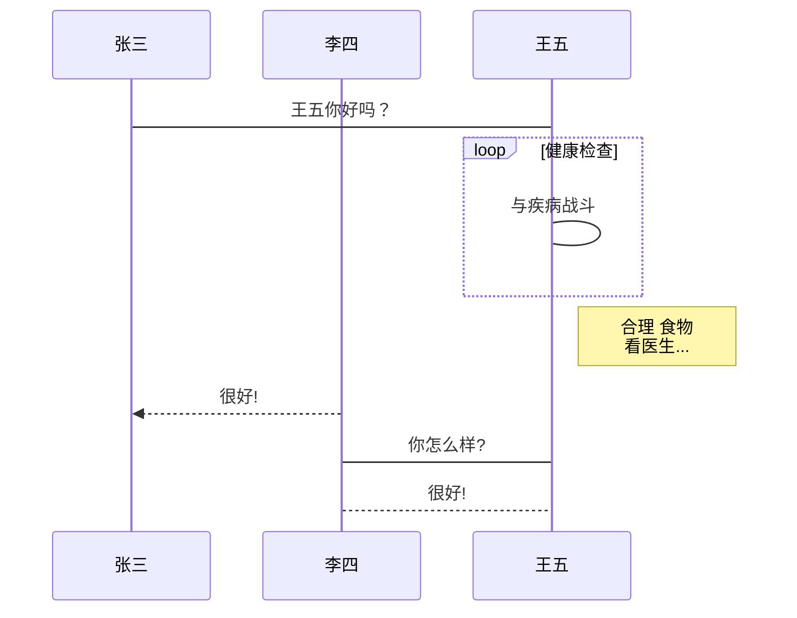
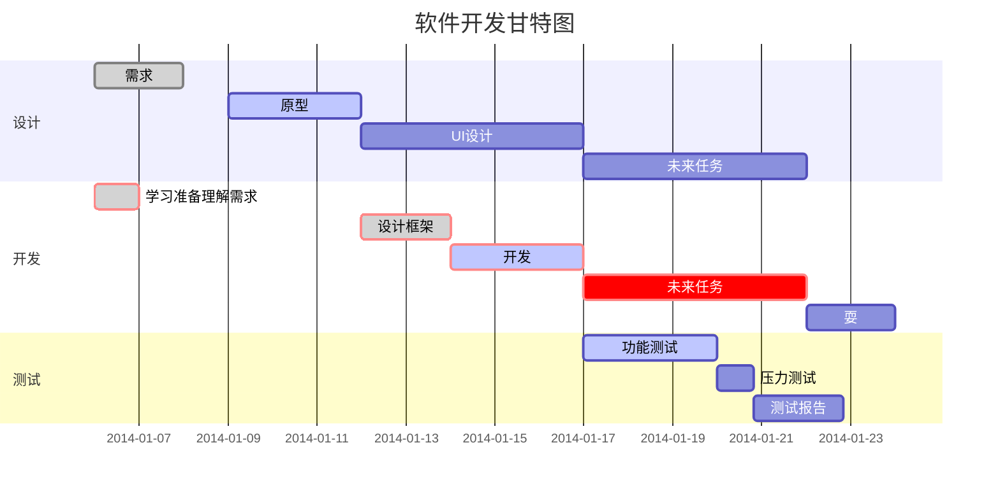

[文章参考网址](https://sspai.com/post/54912)
[官方文档](https://support.typora.io)


## 关于Typora

主要使用Github制定的GFM标准。可以在`文件 - 偏好设置 - Markdown 语法偏好 - 严格模式 `中将标准设置为「更严格地遵循 GFM 标准」。

## 主题美化
在 Typora 中 CSS 被称为「主题」，但其本质仍是 CSS 文件。可以在`文件 - 偏好设置 - 主题 - 打开主题文件夹`看到这些 CSS 文件。也可以自己修改、新建适合使用需求的 CSS 文件。

Typora 自带了若干主题，可以在 [官网](http://theme.typora.io/) 下载更多的主题。

## 常用写作设置
通过打开`文件 - 偏好设置`定制适合自己编辑习惯的设置。
### 实时预览
通过`视图 - 源代码模式`或左下角的 \</\> 按钮或用快捷键`command+ /`(Mac)进入源代码模式（Source Mode）。
### 打字机模式&专注模式
在`视图 - 专注模式 / 打字机模式`中勾选使用这两个模式。
「打字机模式」使得你所编辑的那一行永远处于屏幕正中。
「专注模式」使你正在编辑的那一行保留颜色，而其他行的字体呈灰色。
### 智能标点
可以自动将不是很美观的直引号 " ' 转化为更美观的弯引号 “ ‘ ’ ”。详情见[官方文档](https://support.typora.io/SmartyPants/)。

## 换行
在 Markdown 语法中，换行（line break）与换段是不同的。且换行分为软换行和硬换行。

> 软换行：在 Typora 中可以通过`Shift + Enter`完成一次软换行。软换行只在编辑界面可见，当文档被导出时换行会被省略。
> 硬换行：通过`空格 + 空格 + Shift + Enter`完成一次硬换行，或直接插入HTML标签\<br/\>。这也是许多 Markdown 编辑器所原生支持的。硬换行在文档被导出时将被保留，且没有换段的段后距。  

换段：通过 Enter 完成一次换段。Typora 会自动帮你完成两次 Shift + Enter 的软换行，从而完成一次换段。这也意味着在 Markdown 语法下，换段是通过在段与段之间加入空行来实现的。
> **Windows 风格（CR+LF）与 Unix 风格（CR）的换行符**
> CR 表示回车 `\r`,即回到一行的开头，而 LF 表示换行`\n `,即另起一行。 
所以 Windows 风格的换行符本质是「回车 + 换行」，而 Unix 风格的换行符是「换行」。这也是为什么 Unix / Mac 系统下的文件，如果在 Windows 系统直接打开会全部在同一行内。 可以在`文件 - 偏好设置 - 编辑器 - 默认换行符`中对此进行切换。

## 表格插入
不需要按传统的md语法要求的操作，只需要在行内`鼠标右键 - 插入 - 表格`(注意不能在源代码模式下操作），并输入行数和列数，Typora 就会自动生成一张样式不错的空表格。

## 图片插入
Markdown 原生不太注重图片插入的功能，但可以在 Typora 中：

+ 直接使用`右键 - 复制`+` Ctrl + V`将网络图片、剪贴板图片复制到文档中。
+ 拖动本地图片到文档中

Typora 会自动帮你插入符合 Markdown 语法的图片语句，并给它加上标题。
你也完全可以使用图床来保证文档在分享后图片仍能正常显示。
>更强大的是，Typora 支持在拖动或 `Ctrl + V` 网络图片后自动将其保存到本地。可以在`文件 - 偏好设置 - 编辑器 - 图片插入`中选择复制到哪个路径，什么情况下需要复制。
### 空格
已经把设置改了，现在导出也会保留连续空格。
输入连续空格后，会在编辑器视图里保留这些空格，但打印或导出时，这些空格会被省略成一个。 
在源代码模式下，为每个空格前加一个 `\` 转义符，或者直接使用 HTML 风格的 `&nbsp;`(No-Break Space) 来保持连续的空格。

## 表情插入
emoji：用`:emoji:`的形式打出。

## 链接引用和脚注
链接引用类似于我们常在论文末尾看到的「参考文献」的写法，你可以通过`[]:` 的语法来为你的文档加上链接引用。

脚注即某段话结尾右上角标有数字标记，页面底部进行注释的写法。你可以在需要插入脚注标号的位置写 `[^ number ]` ，再在下方通过` [^ number ]:` 在文档中插入脚注。
> **注意: 不要遗漏了脚注编号 `number` 前后的空格 !**

示例\[^ 这是一个脚注 \][^ 这是一个脚注 ] 
[^ 这是一个脚注 ]:脚注内容

## YAML front-matter

Typora 支持在文档头部加上基于 YAML 的 front-matter 信息，这一特性适用于把 Markdown 文档分类归档上传到用 Hexo 框架搭建的博客中。

## LaTeX
Typora 原生支持 LaTeX 语法，有两种方式输入 LaTeX 风格的数学公式：
行内公式（inline）：用\$...\$ 括起公式，公式会出现在行内。
块间公式（display）：用\$\$...\$\$ 括起公式（注意 \$\$ 后需要换行），公式会默认显示在行中间。

## 其它使用范例
###  typora 画流程图、时序图(顺序图)、甘特图
1、横向流程图源码格式：
横向流程图</img>



2、竖向流程图源码格式：

竖向流程图</img>


3、标准流程图源码格式：
标准流程图</img>

```flow
st=>start: 开始框
op=>operation: 处理框
cond=>condition: 判断框(是或否?)
sub1=>subroutine: 子流程
io=>inputoutput: 输入输出框
e=>end: 结束框
st->op->cond
cond(yes)->io->e
cond(no)->sub1(right)->op
```
4、标准流程图源码格式（横向）：
横向标准流程图</img>

```flow
st=>start: 开始框
op=>operation: 处理框
cond=>condition: 判断框(是或否?)
sub1=>subroutine: 子流程
io=>inputoutput: 输入输出框
e=>end: 结束框
st(right)->op(right)->cond
cond(yes)->io(bottom)->e
cond(no)->sub1(right)->op
```
5、UML时序图源码样例：
UML时序图</img>

```sequence
对象A->对象B: 对象B你好吗?（请求）
Note right of 对象B: 对象B的描述
Note left of 对象A: 对象A的描述(提示)
对象B-->对象A: 我很好(响应)
对象A->对象B: 你真的好吗？
```
6、UML时序图源码复杂样例：
复杂UML</img>

```sequence
Title: 标题：复杂使用
对象A->对象B: 对象B你好吗?（请求）
Note right of 对象B: 对象B的描述
Note left of 对象A: 对象A的描述(提示)
对象B-->对象A: 我很好(响应)
对象B->小三: 你好吗
小三-->>对象A: 对象B找我了
对象A->对象B: 你真的好吗？
Note over 小三,对象B: 我们是朋友
participant C
Note right of C: 没人陪我玩
```
7、UML标准时序图样例：
标准UML</img>


8、甘特图样例：
甘特图</img>

